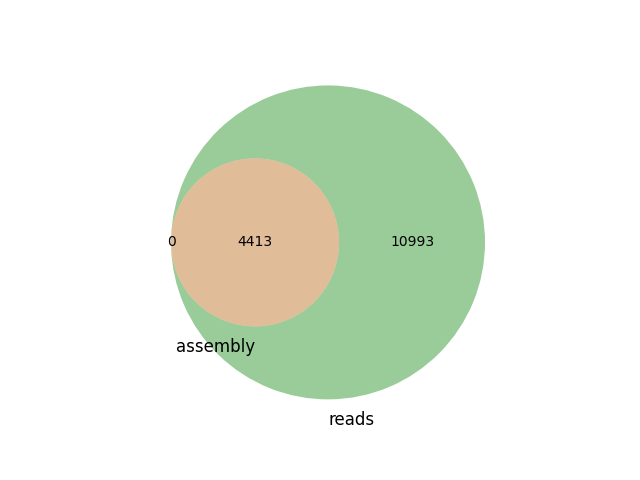

# sourmash_plugin_venn: generate a simple Venn diagram for two sourmash sketches

Generate Venn diagrams showing overlaps between two
[sourmash sketches](https://sourmash.readthedocs.io/) of DNA or
protein sequences:



## Execution

```
sourmash scripts venn examples/a.sig.gz examples/b.sig.gz -o a-b.png

sourmash scripts venn examples/a.sig.gz examples/b.sig.gz -o a-b.png --name1 A --name2 B

sourmash scripts venn examples/a.sig.gz examples/b.sig.gz examples/c.sig.gz -o a-b-c.png 

sourmash scripts venn examples/a.sig.gz examples/b.sig.gz examples/c.sig.gz -o a-b-c.png --name1 A --name2 B --name3 C
```

## Installation

```
pip install sourmash_plugin_venn
```

## Generating a release

Bump version number in `pyproject.toml` and push.

Make a new release on github.

Then pull, and:

```
python -m build
```

followed by `twine upload dist/...`.
